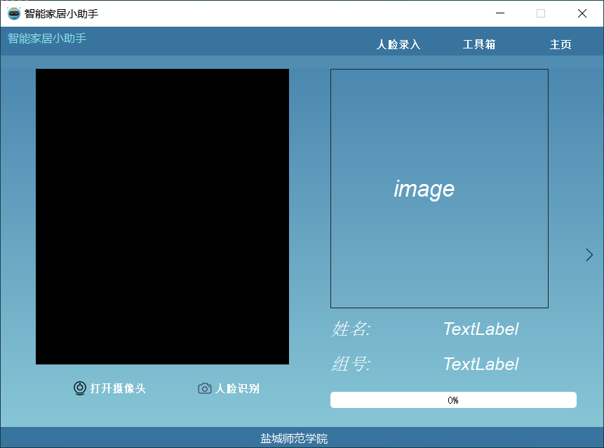

# **《智能家居小助手》**

## 项目介绍

本系统分为硬件和软件两部分，系统硬件部分以CC2530开发板为控制器和处理中心，实现了对环境温湿度、光照强度、灯具开关的监测与控制，RFID刷卡，系统软件部分上位机使用QT编写，实现了人脸识别、数据存储、动态温湿度折线图以及硬件控制等功能。

****

## 开发环境

开发系统：Windows 10、阿里云Linux Ubuntu服务器

软件版本：Qt5.12.2（MSVC 2015,32bit）

## 下载代码

git clone https://github.com/Riny00/SmartHomeAssistant.git

## 系统功能

### 人脸识别页面

### 系统首页

### 服务端连接页面

### 控制主界面

### 客厅

### 卧室（未开启硬件）

### 浴室

### 动态温度折线图（未开启硬件）

### 实时天气情况

### 智能模式

